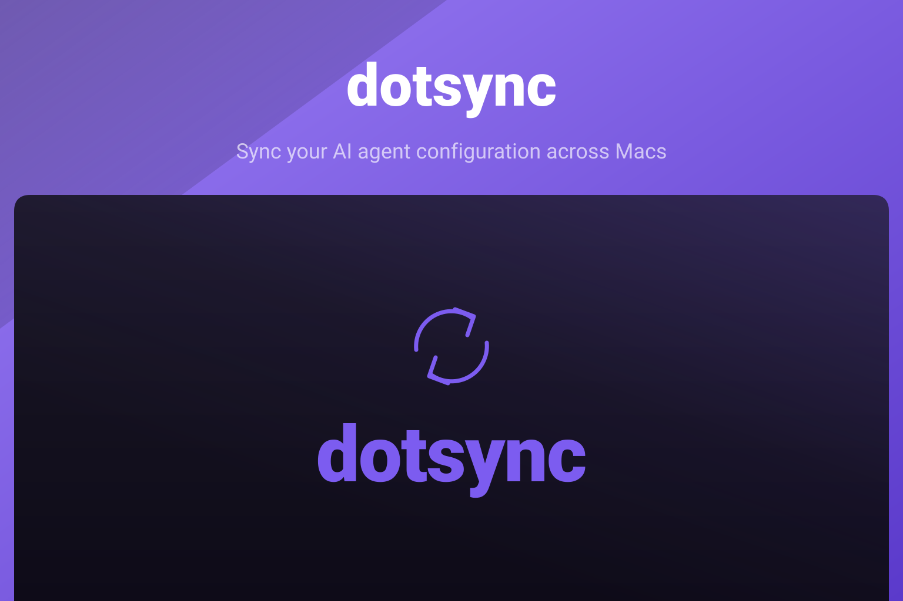

<p align="center">
  
</p>

<p align="center">
  <a href="https://github.com/akira-foundation/dotsync/actions/workflows/ci.yml"></a>
  <a href="https://github.com/akira-foundation/dotsync/releases"></a>
  
  
</p>

Keep your AI agent configuration folders in sync across Macs, using git you already understand
and a private GitHub repository per folder. dotsync lives in the menu bar, finds folders like
`~/.claude` and `~/.codex`, turns each one into a git repository with a secret-safe ignore list,
and keeps every machine up to date. Credentials never travel in clear text: they are either
excluded or encrypted with age.

## Install

Download the latest signed and notarized `.dmg` from
[Releases](https://github.com/akira-foundation/dotsync/releases), drag the app to
`/Applications`, and launch it. Updates arrive automatically through Sparkle.

Requirements:

- macOS 26 or later, Apple Silicon
- `git`
- [`gh`](https://cli.github.com) authenticated (`gh auth login`) for repository creation
- [`age`](https://github.com/FiloSottile/age) when secret encryption is enabled
  (dotsync offers to install it through Homebrew)

## How it works

**Discovery.** On launch dotsync looks for known agent folders (`~/.claude`, `~/.codex`,
`~/.gemini`, `~/.aider`, `~/.continue`, `~/.cursor`) plus anything you add yourself. Folders you
remove are remembered and never re-added.

**Onboarding.** For a folder that is not a repository yet, dotsync runs `git init`, writes a
per-tool allowlist, scans for secrets, then creates a private GitHub repository and pushes. Every
outward step asks first: no repository is created and nothing is pushed without a confirmation.

**Allowlist before anything else.** The generated `.gitignore` ignores everything and then
re-enables only real configuration. Session transcripts, caches, logs and credential files never
enter the index. The rules differ per tool, because `~/.claude` and `~/.codex` do not share a
layout.

**Secret scanning.** Before every push the tracked file set is scanned for API keys, tokens and
private keys. A hit blocks the sync and names the file responsible. False positives can be
ignored per file from the alert.

**Encryption.** With encryption enabled, credential files are encrypted with age instead of being
skipped, so they sync too. Each machine holds its own key pair: the private key stays in that
machine's Keychain, the public key is registered in the repository. Files are encrypted to every
registered machine, so adding a Mac never means copying a private key.

**Syncing.** Configuration merges rather than overwrites: markdown and JSONL use a union merge,
JSON files use a structural merge driver. On a real conflict your version is kept on a backup
branch and the row offers to resolve it.

**Triggers.** Sync runs on an interval, on file changes, or on demand. File-change syncing only
fires when git reports tracked changes, so background noise never causes commits.

## Security model

- Repositories are always private. No code path creates a public one.
- Credential files (`.credentials.json`, `auth.json`, `*.local.json`) are never tracked in clear
  text. They are ignored, or encrypted with age.
- The secret scanner blocks the sync instead of warning.
- Creating a repository and the first push always require explicit confirmation.
- The GitHub account and host are chosen by you and pinned for every `gh` call.

## Configuration

Settings live in `~/.dotsync/settings.json` and the roots list in `~/.dotsync/config.json`.
Everything is editable from the Settings panel: GitHub account, repository naming, discovery,
sync interval, file watching, launch at login and encryption.

## Documentation

- [Core sync design](docs/superpowers/specs/2026-07-20-dotsync-design.md)
- [Onboarding and GitHub provisioning](docs/superpowers/specs/2026-07-20-dotsync-onboarding-github.md)

## Testing

```sh
swift test --arch arm64
```

## Changelog

Please see [CHANGELOG.md](CHANGELOG.md) for what has changed recently.

## Contributing

Please see [CONTRIBUTING.md](CONTRIBUTING.md) for details.

## Security Vulnerabilities

Please review [our security policy](SECURITY.md) on how to report security vulnerabilities.

## Credits

- [Kidiatoliny Gonçalves](https://github.com/kidiatoliny)
- [All Contributors](https://github.com/akira-foundation/dotsync/graphs/contributors)

## License

MIT License. See [LICENSE](LICENSE) or https://opensource.org/licenses/MIT.

Unless you explicitly state otherwise, any contribution intentionally submitted for inclusion in
this project by you shall be licensed as above, without any additional terms or conditions.
